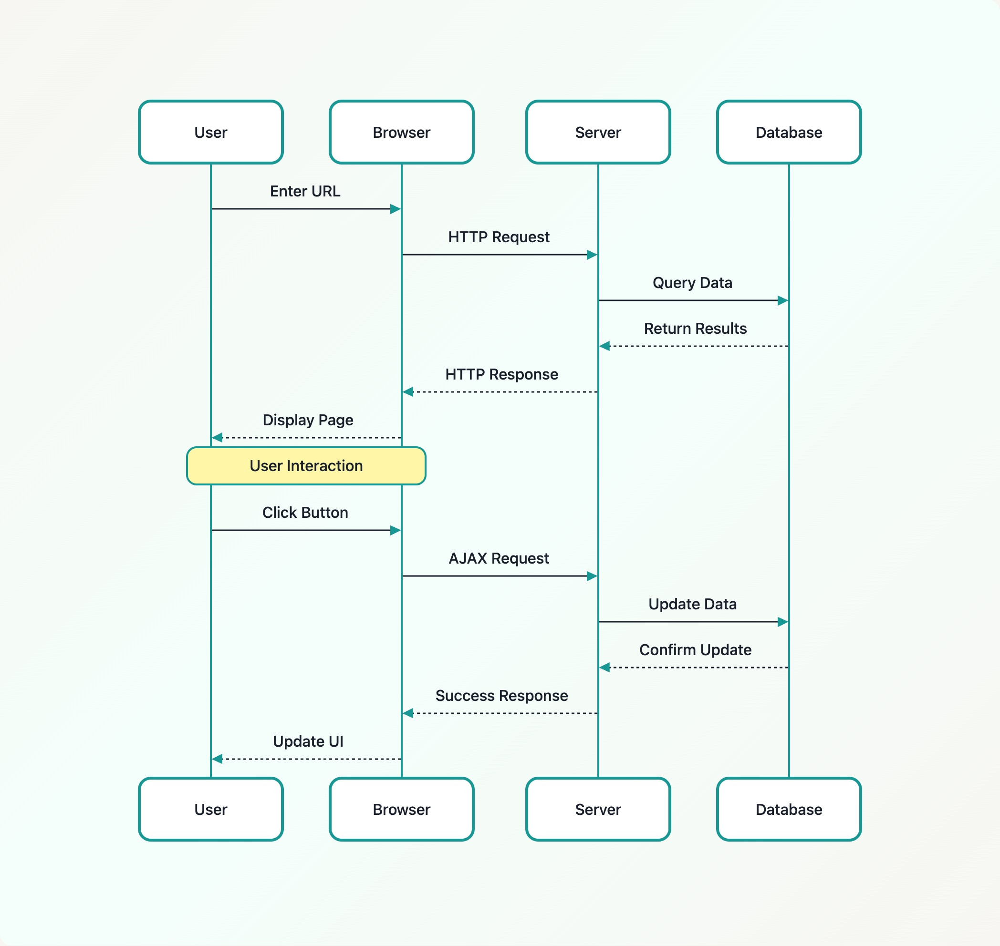
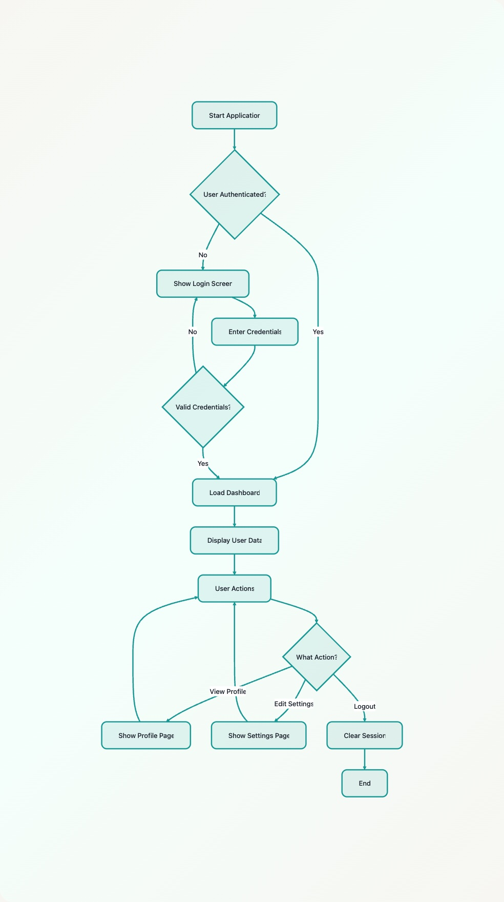
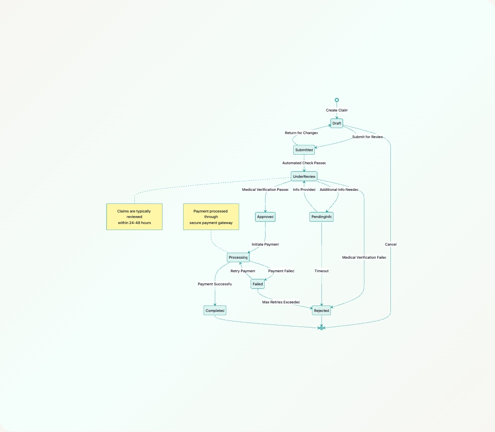
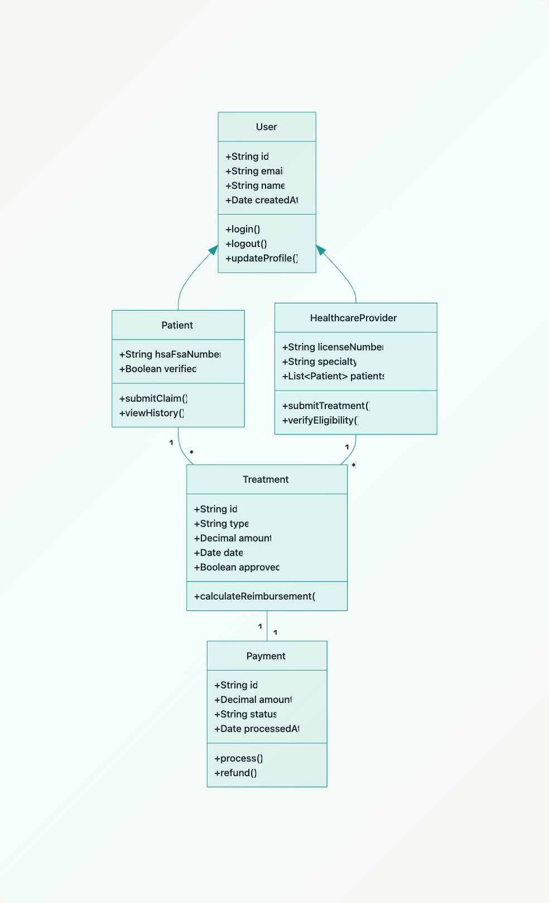

# Mermaid Viber CLI

A command-line tool that converts Mermaid diagram text files into beautifully styled JPEG images, powered by [mermaid-vibes](https://github.com/truemedicine/mermaid-vibes).

## Example Output

### Sequence Diagram



### Flowchart



### State Diagram



### Class Diagram



## Installation

```bash
npm install -g mermaid-viber-cli
```

Or install locally:

```bash
npm install mermaid-viber-cli
```

## Usage

### Basic Usage

Place your Mermaid diagram text files in a directory, then run:

```bash
mermaid-viber --input ./my-diagrams --output ./my-images
```

This will process all `.txt` files in the input directory and create corresponding `.jpg` files in the output directory.

### Options

| Flag | Description | Default |
|------|-------------|---------|
| `-i, --input <dir>` | Input directory containing `.txt` files | `mermaids` |
| `-o, --output <dir>` | Output directory for JPEG files | `images` |
| `-h, --help` | Display help | |
| `-V, --version` | Display version | |

## Diagram Syntax

Any standard [Mermaid](https://mermaid.js.org/) syntax is supported. Save your diagram as a `.txt` file:

**Flowchart:**
```
graph TD
    A[Start] --> B{Decision}
    B -->|Yes| C[Do Something]
    B -->|No| D[Do Something Else]
    C --> E[End]
    D --> E
```

**Sequence Diagram:**
```
sequenceDiagram
    User->>Browser: Enter URL
    Browser->>Server: HTTP Request
    Server->>Database: Query Data
    Database-->>Server: Return Results
    Server-->>Browser: HTTP Response
    Browser-->>User: Display Page
```

**State Diagram:**
```
stateDiagram-v2
    [*] --> Draft
    Draft --> Submitted: Submit for Review
    Submitted --> UnderReview: Automated Check Passed
    UnderReview --> Approved: Verification Passed
    UnderReview --> Rejected: Verification Failed
    Approved --> Completed
    Completed --> [*]
```

### Custom Actor Images

Add logos or avatars to sequence diagram actors using the `img:` prefix:

```
sequenceDiagram
    participant img:https://example.com/user-icon.png User
    participant img:https://example.com/server-icon.png Server
    User->>Server: Request
    Server-->>User: Response
```

## Styling

All output uses the [mermaid-vibes](https://www.npmjs.com/package/mermaid-vibes) design system:

- Teal accent palette with warm off-white backgrounds
- Glowing node borders with subtle pulse animations
- Rounded corners and generous padding
- Styled edge labels with light borders
- High-contrast typography

## Development

```bash
git clone https://github.com/truemedicine/mermaid-viber-cli.git
cd mermaid-viber-cli
npm install
npm run dev
```

Build for production:

```bash
npm run build
```

## License

MIT
