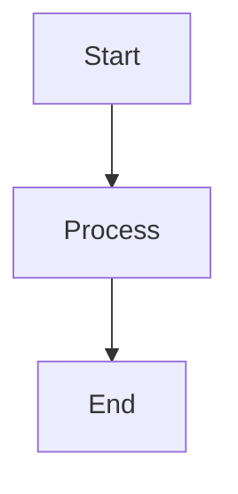
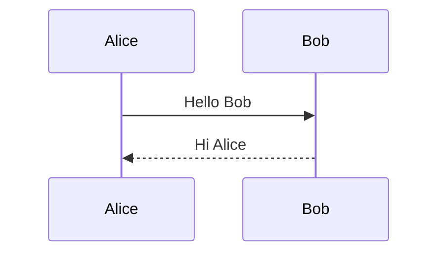
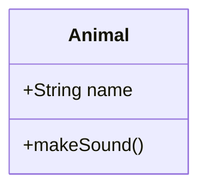

# Mermaid Viber CLI

A command-line utility that converts Mermaid diagram text files into beautifully styled JPEG images. Built with the same visual design system as the `mermaid-app`, featuring the Truemed aesthetic with teal accents and organic styling.

## Features

- 🎨 Converts `.txt` files containing Mermaid diagrams to styled `.jpg` images
- 🖼️ Supports custom actor images in sequence diagrams
- 🎯 Batch processing of multiple diagram files
- 💅 Consistent styling with Truemed design system
- 📦 Uses the public `mermaid-vibes` NPM package

## Installation

```bash
cd mermaid-viber
npm install
npm run build
```

## Usage

### Basic Usage

Place your Mermaid diagram text files in the `mermaids/` directory, then run:

```bash
npm start
```

This will process all `.txt` files in the `mermaids/` directory and create corresponding `.jpg` files in the `images/` directory.

### Custom Directories

You can specify custom input and output directories:

```bash
node dist/index.js --input ./my-diagrams --output ./my-images
```

### Options

- `-i, --input <directory>` - Input directory containing .txt files (default: "mermaids")
- `-o, --output <directory>` - Output directory for JPEG files (default: "images")
- `-h, --help` - Display help information
- `-V, --version` - Display version number

## Mermaid Diagram Syntax

### Standard Diagrams

Any standard Mermaid diagram syntax is supported:

**Flowchart:**


**Sequence Diagram:**


**Class Diagram:**


### Custom Actor Images

You can add custom images to actors in sequence diagrams using the special `img:` syntax:

```mermaid
sequenceDiagram
    participant img:https://example.com/user.png User
    participant img:https://example.com/server.png Server
    participant img:./local-image.png Database

    User->>Server: Request Data
    Server->>Database: Query
    Database-->>Server: Results
    Server-->>User: Response
```

**Syntax:** `participant img:<url-or-path> ActorName`

- Supports both HTTP(S) URLs and local file paths
- Images are automatically rounded and positioned in the actor box
- Use PNG, JPG, or SVG images for best results

## Examples

The `mermaids/` directory includes several example diagrams:

1. **flowchart.txt** - User authentication flow
2. **sequence-basic.txt** - Basic web request sequence
3. **sequence-with-images.txt** - Healthcare workflow with custom actor images
4. **class-diagram.txt** - Healthcare system class structure
5. **state-diagram.txt** - Claim processing state machine

## Styling

All exported images use the Truemed design system:

- **Primary Color:** Teal (#179895)
- **Background:** Warm off-white (#F7F6F2)
- **Accent Colors:** Yellow highlights, cyan tints
- **Typography:** System fonts with 500 weight
- **Borders:** 3px rounded borders on nodes
- **Padding:** 100px padding around diagrams

## Architecture

The CLI is built with:

- **TypeScript** - Type-safe development
- **Mermaid.js** - Diagram rendering engine
- **JSDOM** - DOM implementation for Node.js
- **Sharp** - High-performance image processing
- **Commander** - CLI argument parsing

## Project Structure

```
mermaid-viber/
├── src/
│   ├── index.ts        # CLI entry point
│   ├── renderer.ts     # Mermaid rendering and JPEG export
│   ├── preprocessor.ts # Actor image preprocessing
│   └── theme.ts        # Truemed design system config
├── mermaids/           # Input directory (.txt files)
├── images/             # Output directory (.jpg files)
├── package.json
├── tsconfig.json
└── README.md
```

## Development

Run in development mode with auto-reload:

```bash
npm run dev
```

Build for production:

```bash
npm run build
```

## License

MIT

## Credits

Built by Truemed, using the `mermaid-vibes` styling library.
